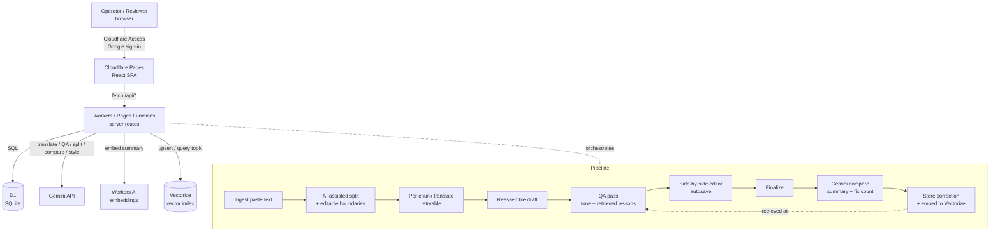
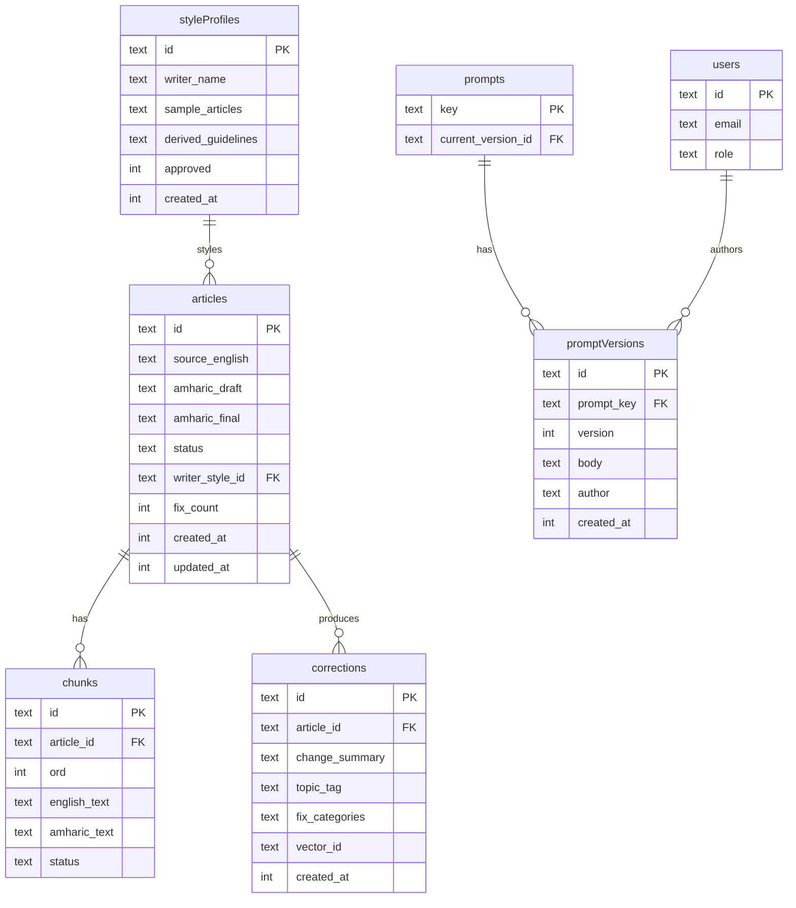

# Architecture — AI Translation & Self-Improving QA System

**Source PRD:** `prd-ai-translation-qa` (Approved, Cloudflare stack)
**Author of this doc:** System Architect
**Stack decision:** Option C — Cloudflare all-in (Pages/Workers + D1 + Vectorize + Workers AI), Gemini for language tasks, Cloudflare Access for auth.

---

## 1. Overview

The product turns English source articles into publication-ready Amharic. An operator pastes an English article; the system splits it into quality-sized chunks, translates each with Gemini, reassembles one Amharic draft, and runs an automated QA pass that fixes grammar, wording, and machine-translation stiffness while applying a chosen writer's tone. A human reviewer edits the result in a side-by-side editor with autosave and finalizes it.

The distinguishing feature is a **self-improving QA loop**: every time a human finalizes an article, the system asks Gemini to compare the QA output against the human-final version, producing a change summary ("what was wrong, what to check next time") and a fix count. Those summaries accumulate in a correction library. At QA time, the most relevant past summaries are retrieved and injected into the QA prompt, so the model applies lessons from prior human corrections. This is retrieval-augmented (RAG) — **no model training or fine-tuning**.

**Users:** 2 internal, trusted (one is also Admin). **Scale:** tiny — dozens of articles, tens-to-few-hundred correction examples. **Cost posture:** everything on Cloudflare free tier; the only metered external cost is Gemini API tokens, which the design minimizes.

**Core goals:** (1) reduce human fixes per article and have that number trend down as the library grows; (2) automate the split→translate→QA pipeline; (3) never lower final quality — the human stays the final gate.

## 2. Chosen stack & rationale

| Layer | Choice | Why it fits *this* project |
|---|---|---|
| Hosting + API | Cloudflare Pages + Workers | Workers bill by CPU time, not wall-clock, so multi-second Gemini translation/QA calls don't hit a request-timeout wall the way they would on a serverless free tier with a hard 10s cap. One vendor for app + data + vectors. |
| Database | Cloudflare D1 (SQLite) | The data is relational — articles→chunks, prompts→promptVersions, articles→corrections. SQL models this directly and makes prompt version-history/rollback trivial (a WHERE on a version table). Free tier is ample for 2 users. |
| Vector search | Cloudflare Vectorize | Native nearest-neighbour query. No hand-rolled cosine-similarity code, no free-tier vector-search gap to engineer around. Lives on the same platform as everything else. |
| Embeddings | Cloudflare Workers AI | Generates embedding vectors for correction summaries on-platform, no second AI vendor for this step. (Gemini embeddings remain a drop-in fallback.) |
| Language AI | Google Gemini API | Translation, QA, AI-assisted splitting, style-profile extraction, and the finalize-time comparison (change summary + fix count). |
| Auth | Cloudflare Access | Two fixed users; Access gates the whole app at the edge with Google sign-in and needs no in-app session code. Admin is one identity, checked in a `users` table for role-gated routes. |
| Framework | A Pages app (React frontend) with Workers/Functions for server routes | Keeps frontend and API in one deploy. Server routes hold the Gemini key and all D1/Vectorize access; the client never sees a secret. |

**Rejected / deferred (from PRD):** Firestore + Firebase Auth (replaced by D1 + Access to stay single-vendor and dodge Firebase-on-Workers friction); in-app cosine similarity (replaced by Vectorize); file upload and Google Docs API (paste-only input); model fine-tuning (RAG instead).

## 3. System architecture

**Component responsibilities**

- **React SPA (Pages):** all UI — paste box, chunk-boundary editor, side-by-side reviewer editor with local draft buffer, fixes-per-article trend view, admin prompt engine, style-profile management. Holds no secrets; talks only to `/api/*`.
- **Server routes (Workers/Functions):** the only place with the Gemini key and D1/Vectorize bindings. Orchestrates the pipeline, enforces the admin role, does all reads/writes.
- **D1:** system of record for articles, chunks, corrections (metadata), style profiles, prompts + versions, users.
- **Vectorize:** stores one vector per correction summary; queried for top-N at QA time. The vector's ID maps back to a D1 `corrections` row.
- **Workers AI:** turns a correction summary into an embedding vector.
- **Gemini:** every natural-language transformation — split assist, translate, QA, finalize comparison, style extraction.

**Why long calls are safe here:** the pipeline runs inside Workers, which meter CPU not wall-clock, so a translation or QA call that waits several seconds on Gemini doesn't trip a timeout. The client drives the pipeline step-by-step (one call per chunk, one for QA) and shows progress, which also keeps any single request short and makes per-chunk retry natural.

## 4. Data model

Notes:
- `chunks.status` and `chunks.amharic_text` let a single chunk fail/retry without touching the rest of the article (PRD error-handling requirement).
- `corrections.vector_id` is the handle into Vectorize; the embedding itself lives in Vectorize, not D1.
- `corrections.fix_categories` is a JSON array of `{category, detail}` (migration 0008) — one entry per fix counted in that finalize's `fix_count`, tagged with a linguistic category (punctuation, grammar-suffix, wording, tone, clause, other) by the same compare call. Nullable: rows captured before migration 0008 have no breakdown.
- `styleProfiles.approved` supports the "validate one profile early before it's considered done" requirement.
- `prompts.current_version_id` pointing at a `promptVersions` row makes rollback a single-field update — no history is destroyed.
- Array-ish fields (`sample_articles`) are stored as JSON text in SQLite.

## 5. API design

Shape only, not exhaustive CRUD. All under `/api`, all behind Cloudflare Access; admin routes additionally check `users.role = 'admin'`.

**Pipeline**
- `POST /api/articles` — create from pasted English; returns article id.
- `POST /api/articles/:id/split` — AI-assisted split into chunks; returns proposed boundaries.
- `PUT  /api/articles/:id/chunks` — save operator-adjusted boundaries.
- `POST /api/articles/:id/chunks/:ord/translate` — translate one chunk (retryable per chunk).
- `POST /api/articles/:id/reassemble` — stitch chunks into `amharic_draft` in order.
- `POST /api/articles/:id/qa` — run QA pass; applies selected style profile + top-N retrieved lessons.

**Review & finalize**
- `PATCH /api/articles/:id/draft` — autosave reviewer's current Amharic text.
- `GET   /api/articles/:id` — load article + latest saved draft for restore-on-reload.
- `POST  /api/articles/:id/finalize` — store final; trigger Gemini compare → change summary + fix count → write `corrections` row + embed to Vectorize.

**Learning & metrics**
- `POST /api/seed` — accept one (English, AI-translation, human-final) triple; run compare, store correction, embed. Called 50+ times to bootstrap.
- `GET  /api/metrics/fixes` — fixes-per-article series for the trend view.

**Style & prompts (admin)**
- `POST /api/styles` — derive a style profile from pasted samples.
- `PATCH /api/styles/:id/approve` — mark a profile validated.
- `GET  /api/styles` — list for selection.
- `GET/PUT /api/prompts/:key` — read current / publish a new version of split|translate|qa prompt.
- `GET  /api/prompts/:key/versions` + `POST /api/prompts/:key/rollback` — history and rollback.

## 6. Auth & security

- **Cloudflare Access** fronts the entire app (Pages + Functions) with Google sign-in restricted to the two known emails. No custom login/session code.
- Server routes read the Access-provided identity, look the email up in `users`, and enforce `role` for admin-only routes (prompt engine, style management).
- **Gemini API key is a Worker secret** — server-side only, never shipped to the client. All Gemini calls originate in server routes.
- Vectorize and D1 are reached only through Worker bindings, never from the browser.
- No PII beyond two internal user emails; no billing; no public sign-up. Threat surface is small by design.

## 7. Third-party integrations

- **Gemini API** — translation, QA, AI-assisted splitting, finalize comparison (summary + fix count), style extraction. The one metered external dependency; cost controlled by large chunks, prompt reuse, and not re-translating unchanged chunks.
- **Cloudflare Workers AI** — embeddings for correction summaries. On-platform, avoids a second AI vendor for retrieval.
- Everything else (hosting, DB, vectors, auth) is native Cloudflare.

## 8. Infra & deployment

- **Hosting:** Cloudflare Pages (SPA) + Pages Functions / Workers (API), all free tier.
- **Bindings:** D1, Vectorize, Workers AI, and the Gemini secret bound to the Worker via `wrangler.toml`.
- **Environments:** a local dev (`wrangler dev`, local D1) and production. A staging Access policy can reuse the same two emails.
- **CI/CD:** push-to-deploy via the Cloudflare Pages Git integration; D1 migrations applied with `wrangler d1 migrations apply`.
- **Config:** all IDs/keys as Wrangler secrets/vars, nothing hardcoded.

## 9. Non-functional requirements

- **Scale:** trivially within free tiers (2 users, dozens of articles). The only growth axis is the correction library; Vectorize handles far more than a few hundred vectors, and query latency should be validated as it grows.
- **Free-tier write budget:** autosave is the main write source. Debounced, minutes-order interval, with unsaved edits buffered in browser state — a normal review session stays well under D1 daily write limits.
- **Resilience:** per-chunk translate is independently retryable; one failed chunk never fails the article. Autosave restore-on-reload guarantees no lost reviewer work across crash/disconnect.
- **Amharic correctness:** Ge'ez script handled end-to-end — UTF-8 storage in D1, correct rendering in the editor, and AI-based comparison (not a character diff) so fix-counting is robust on non-Latin text.
- **Observability:** Workers logs + a minimal request/step log per article; the fixes-per-article series doubles as the product's core health signal.
- **Cost shape:** hosting ~$0; Gemini tokens the only variable cost, minimized by chunking strategy and prompt reuse.

## 10. Risks & open questions

- **Retrieval quality is the whole learning promise.** If top-N summaries aren't relevant, QA won't improve. Mitigated by loading the 50+ seed examples first (P3) so retrieval is tested on real data before launch. Open: does embedding the *summary* out-retrieve embedding article context? Validate with seeds; tune N (3–5).
- **Fix-count stability.** An AI comparison may vary run-to-run. Define "one fix" precisely in the compare prompt and spot-check early. A plain diff remains a cheap fallback for the count only.
- **Style-profile fidelity is unproven.** Whether derived guidelines actually shift tone needs a real-sample check. Mitigated by building + approving one profile early (P3/P4 spike) before the feature is "done."
- **Vectorize free-tier latency at growth.** Fine at hundreds of vectors; revisit only if the library grows large.
- **Workers-runtime library gaps.** Some Node-only libraries won't run on the Workers runtime; prefer Web-standard APIs and Cloudflare bindings. Low risk given the thin dependency set.

---

# Roadmap

Phases are sequenced so each ends with something testable end-to-end, and the two riskiest bets (retrieval quality, style fidelity) are validated on real data before launch. Phase 1 is the smallest genuinely usable slice (paste → Amharic draft), not just a backend.

**Repo context:** a root `CLAUDE.md` holds the standing rules every Claude Code session should load (stack, hard rules, pipeline order, Ge'ez handling, the D1↔Vectorize consistency contract). The per-sprint prompt files carry the task; `CLAUDE.md` carries the rules — keep it at the repo root from Sprint 1.1 onward.

**Model tiering:** each task in the per-sprint prompt files is tagged with a model tier, a specific model ID/version, and a reasoning-effort level. Switch models in Claude Code with `/model <alias-or-id>` before starting a sprint's prompts (or `--model` on a headless run); set effort with the `/effort` control (or the equivalent flag) where your client supports it. Tiers used:
- **Haiku** (`claude-haiku-4-5`) — mechanical scaffolding, config, simple UI/CRUD.
- **Sonnet** (`claude-sonnet-5`) — default for feature work, business logic, most endpoints.
- **Opus** (`claude-opus-4-8`) — decisions costly to unwind: schema, retrieval/RAG wiring, auth, the pipeline orchestration and compare logic.

## Phase 1 — Foundation & pipeline
*Goal: an article goes English-in → Amharic-draft-out.*

**Sprint 1.1 — Project & data foundation**
- Scaffold Cloudflare Pages + Functions app with React frontend
- Configure Wrangler bindings (D1, Vectorize, Workers AI, Gemini secret)
- Author D1 schema + first migration (all tables)
- Cloudflare Access setup + `users` role lookup middleware

**Sprint 1.2 — Ingest, split, translate, reassemble**
- Paste-text ingestion + create-article endpoint
- AI-assisted chunk splitting (500–800+ words, boundary-safe)
- Editable chunk-boundary UI
- Per-chunk Gemini translation with per-chunk retry
- Reassemble chunks into ordered Amharic draft

## Phase 2 — Review & autosave
*Goal: a human can review and safely edit the draft.*

**Sprint 2.1 — Reviewer editor + autosave**
- Side-by-side English/Amharic editor
- Local draft buffer + debounced minutes-order autosave to D1
- Restore-on-reload from latest saved draft
- Finalize action (stores human-final, sets status)

## Phase 3 — Learning loop (de-risk early)
*Goal: corrections captured and fed back; retrieval proven on real data.*

**Sprint 3.1 — Compare, store, embed**
- Finalize-time Gemini compare → change summary + fix count
- Store `corrections` row; embed summary via Workers AI → Vectorize upsert
- Seed intake endpoint + UI for 50+ triples (runs the same compare/embed)

**Sprint 3.2 — Retrieval into QA + metrics**
- QA pass endpoint that retrieves top-N summaries from Vectorize and injects them
- Wire QA into the pipeline after reassemble
- Fixes-per-article trend view

## Phase 4 — Tone & prompt engine
*Goal: output matches a writer's voice; admin tunes without a deploy.*

**Sprint 4.1 — Writer style profiles**
- Derive style profile (guidelines) from pasted samples
- Early single-profile quality check + approve flow
- Style selection applied in the QA prompt

**Sprint 4.2 — Admin prompt engine**
- Edit split/translate/QA prompts (admin-only)
- Version history on every publish
- Rollback by pointing `current_version_id` at an older version
